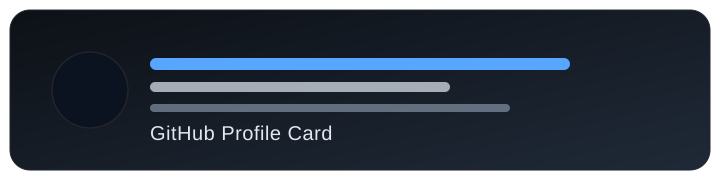
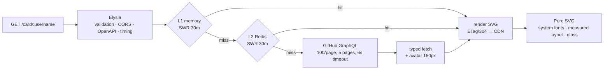

<div align="center">



### Beautiful, blazing-fast GitHub profile cards

Live SVG cards for your README — stars, commits, languages, all auto-updating. One line, zero config, edge-cached.

<br/>

[](https://www.npmjs.com/package/@shiinasaku/github-card)
[](https://bun.sh)
[](https://elysiajs.com)
[](https://www.typescriptlang.org)
[](LICENSE)
[](https://vercel.com/new/clone?repository-url=https://github.com/ShiinaSaku/Github-Card)

<a href="https://card.shiina.xyz/card/shiinasaku?theme=shiina">
  
</a>

<sub>Live instance · <code>shiinasaku</code> · theme <code>shiina</code> — updates itself as you code</sub>

</div>

---

### ✨ What's new in 4.2

> System-font only · no shipped `.woff2` · crisper text (`geometricPrecision`, tabular numbers) · new 24 px icons (MingCute / Huge / Tabler) · airy stat stack with 7 px gaps, no boxes · default `affiliations=owner` — org stars excluded unless `?affiliations=affiliated` · fully typed `github.ts` & `github-client`, cache v8.

---

## Quickstart

Paste into your profile README — replace `shiinasaku` with your username:

```md
[](https://github.com/shiinasaku)
```

That's it. No sign-up, no build — the card refreshes on every push.

<details>
<summary><b>Self-host / local dev</b></summary>

```bash
bun install
cp .env.example .env   # add GITHUB_TOKEN
bun dev                # http://localhost:3000
```

| Command             | Action                |
| ------------------- | --------------------- |
| `bun test`          | Run 51 tests          |
| `bun run typecheck` | Strict `tsc --noEmit` |
| `bun run lint`      | oxlint                |
| `bun run fmt`       | oxfmt                 |

</details>

---

## Why GitHub Card?

<table>
<tr>
<td width="50%">

**One line, zero config**<br/>
An `` tag is the entire integration. No OAuth, no action.

**Edge-fast**<br/>
L1 memory + L2 Redis SWR, `s-maxage=1800`, `stale-while-revalidate`, `ETag`/`304`. Warm hits render in microseconds.

**Retina avatars**<br/>
Profile images inlined as Base64 at 2×, clipped + ringed in pure SVG.

</td>
<td width="50%">

**Adaptive layout**<br/>
Width, wrapping, and legends measured with per-glyph metrics — nothing ever overlaps or clips.

**Users _and_ orgs**<br/>
`GET /card/:login` works for users and organizations.

**Glassmorphic depth**<br/>
Radial + linear ambient gradients track your accent for volumetric light at zero runtime cost.

</td>
</tr>
</table>

OpenAPI docs live at [`/openapi`](https://card.shiina.xyz/openapi). Pure ESM lib, zero server dep for `renderCard`.

---

## Themes — 21 hand-tuned

Preview **every** theme with your own data:

```md

```

| Dark favorites                                     | Light & accent                                   |
| -------------------------------------------------- | ------------------------------------------------ |
| `shiina` · `aurora` · `oled` · `slate`             | `default` · `pearl` · `sand`                     |
| `github_dark` · `dark` · `nord` · `dracula`        | `forest` · `rose` · `cobalt`                     |
| `tokyonight` · `synthwave` · `radical` · `monokai` | `gruvbox` · `merko` · `onedark` · `highcontrast` |

Add `?theme=tokyonight` or override any slot with hex or Tailwind tokens: `pink-400`, `#ff79c6`, `ff79c6`.

---

## Customization

| Parameter      |    Type    | Description                                                       |
| -------------- | :--------: | ----------------------------------------------------------------- |
| `theme`        |  `string`  | Built-in theme (table above)                                      |
| `bg_color`     |  `string`  | Background fill                                                   |
| `title_color`  |  `string`  | Name / title                                                      |
| `text_color`   |  `string`  | Stats, labels, body                                               |
| `icon_color`   |  `string`  | Icons + ambient glow                                              |
| `border_color` |  `string`  | Card outline                                                      |
| `hide_border`  | `boolean`  | Remove outline                                                    |
| `compact`      | `boolean`  | Slim — hides bio/pronouns/Twitter/legend                          |
| `animate`      | `boolean`  | Fade-in stats + animated language bar                             |
| `hide`         | `string[]` | Hide stats: `stars`, `commits`, `issues`, `repos`, `prs`          |
| `hide_langs`   | `string[]` | Exclude `hide_langs=html,css`                                     |
| `show_langs`   | `string[]` | Only `show_langs=typescript,rust`                                 |
| `lang_count`   |   `1–10`   | Top languages (default `5`)                                       |
| `scope`        |  `string`  | `personal` (default), `org`, `all`                                |
| `orgs`         | `string[]` | Restrict org stats to `orgs=vercel,elysiajs`                      |
| `affiliations` |  `string`  | `owner` (default) or `affiliated` — org stars excluded by default |
| `fields`       | `string[]` | Fetch only `fields=stats` for speed                               |

#### Examples

```md
<!-- Dracula, no border, animated -->


<!-- Fully custom colors -->


<!-- Compact, no issues/prs -->


<!-- Include org stars explicitly -->


<!-- Organization -->


```

---

## Deploy your own

[](https://vercel.com/new/clone?repository-url=https://github.com/ShiinaSaku/Github-Card)

1. Click the button (or fork + import).
2. Add env vars:

|    Variable    | Required | Purpose                             |
| :------------: | :------: | ----------------------------------- |
| `GITHUB_TOKEN` |    ✅    | GitHub PAT — read-only is enough    |
|  `REDIS_URL`   |    ➖    | Redis / Upstash for shared L2 cache |

3. Done — serves `/card/:username` on Vercel CDN `s-maxage=1800, stale-while-revalidate=1800`.

> Without Redis, in-memory LRU (1000 entries, SWR 30 min) still keeps warm instances fast.

---

## API

| Endpoint                | Description                                 |
| ----------------------- | ------------------------------------------- |
| `GET /card/:username`   | SVG card — all params above                 |
| `GET /:username/themes` | One SVG with **all themes** for a user      |
| `GET /meta`             | Service metadata + theme list               |
| `GET /health`           | Uptime, cache telemetry, Redis reachability |
| `GET /openapi`          | Interactive OpenAPI docs                    |

Responses: `image/svg+xml`, `ETag` + `CDN-Cache-Control` + CORS `*`. Conditional `If-None-Match` → `304`.

---

## Use as a library

```bash
bun add @shiinasaku/github-card     # Bun
npm install @shiinasaku/github-card # Node / Next / Vite
```

```ts
import { renderCard, themes } from "@shiinasaku/github-card";

const svg = renderCard(user, stats, languages, { theme: "tokyonight" });
// → string of SVG, zero deps, any runtime
```

Prebuilt `dist/lib.js` + `.d.ts`; Bun resolves raw TS via `bun` export condition. Pure renderer — no network, no server.

---

## Architecture



- **Bun + Elysia** — one of the fastest HTTP stacks.
- **Two-tier SWR** — stale served instantly + background refresh, request coalescing via `inFlight`.
- **Typed upstream** — `RepoNode`/`ContributionEntry` generics, `T=unknown`, `TimeoutError`/`RateLimitError` mapping.

---

## Releasing

Fully automated:

1. **Actions → Bump** → `patch` / `minor` / `major`.
2. Workflow bumps `package.json`, commits, tags `vX.Y.Z`.
3. Tag triggers **Release**: `oxfmt` · `oxlint` · `typecheck` · `tests` · `dist` build · tag↔version guard · `npm pack` verify → publish with [provenance](https://docs.npmjs.com/generating-provenance-statements) + GitHub Release.

---

<div align="center">

**[MIT](LICENSE) © [saku shiina](https://www.shiina.xyz)** — built with Bun, Elysia, and system fonts.

<sub>Stars default to <code>owner</code> only in 4.2 — add <code>?affiliations=affiliated</code> to include orgs.</sub>

</div>
